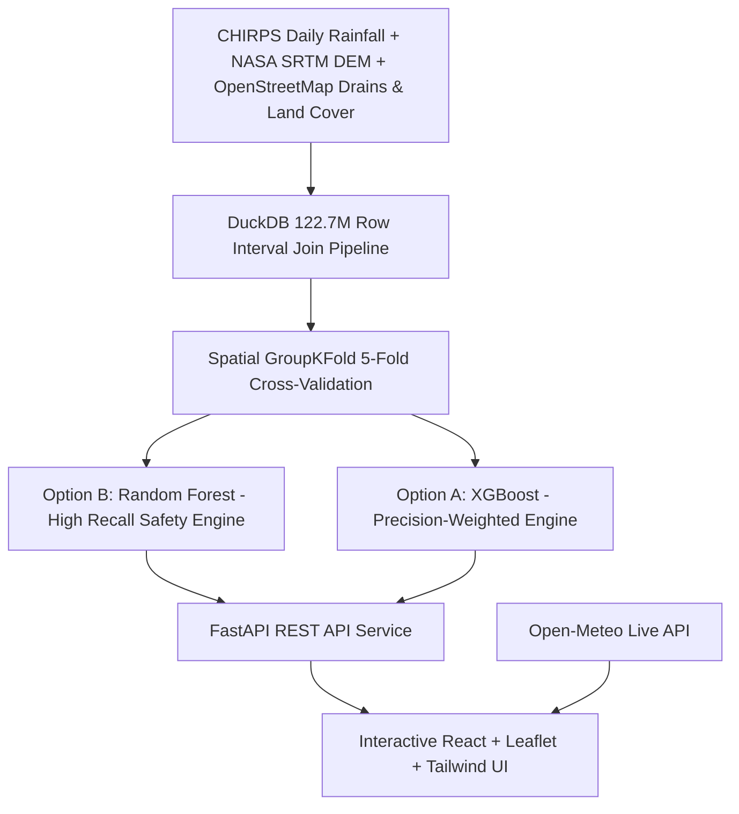

# 🌊 Lagos Urban Flood Risk Prediction System

[](https://opensource.org/licenses/MIT)
[](https://www.python.org/)
[](https://fastapi.tiangolo.com/)
[](https://vitejs.dev/)
[](https://www.docker.com/)

An open-source machine learning system and interactive spatial risk platform designed to model, simulate, and predict urban flood vulnerabilities across **Lagos State, Nigeria** at 500m grid resolution.

---

> [!IMPORTANT]
> ### ⚠️ Model Status & Early-Stage Safety Notice
> **Trained on 499 known flood events across 28 confirmed locations in Lagos** — an early-stage risk indicator, not a certified meteorological forecast. Precision and recall are moderate (~50%), meaning roughly half of flagged alerts may be false alarms, and some real flood risk may be missed. 
> 
> **Option B (Random Forest Safety Standard)** is deployed as the default inference engine to explicitly prioritize catching real floods (up to **92% sensitivity**) over avoiding false alarms in emergency situations.

---

## 🏛️ System Architecture



---

## 📊 Measured 5-Fold Spatial Cross-Validation Performance

All models are evaluated strictly with **5-Fold Spatial GroupKFold Cross-Validation** (`grid_id` holdout) to ensure **zero spatial leakage** onto unseen terrain across Lagos State ($N = 25,449$ out-of-fold test instances):

| Strategy | Model | Decision Threshold | Measured Recall (Sensitivity) | Measured Precision | Caught Floods | Missed Floods | Primary Intent |
| :--- | :--- | :--- | :--- | :--- | :--- | :--- | :--- |
| **Option B (Default)** | **Random Forest** | **0.20** *(Moderate)* | **91.78%** | 20.02% | **458 / 499** | **41** | **Early Warning (Safety-First)** |
| **Option B (Default)** | **Random Forest** | **0.35** *(Severe)* | **77.96%** | 21.47% | **389 / 499** | **110** | **Critical Flood Precaution** |
| **Option A** | XGBoost | 0.35 *(Severe)* | 52.51% | 51.47% | 262 / 499 | 237 | Balanced Accuracy |
| **Option A** | XGBoost | 0.50 *(Default)* | 48.90% | 66.67% | 244 / 499 | 255 | Conservative / High Precision |

---

## 🚀 Quickstart & Local Deployment

### Option 1: 1-Click Cloud Web Deployment (Free / Zero-Setup)

#### Deploy to Vercel (Frontend + Serverless API)
1. Go to [Vercel.com](https://vercel.com) and log in with GitHub.
2. Click **Add New...** &rarr; **Project** and import `A-Nuel/lagos-flood-prediction`.
3. Vercel automatically detects `vercel.json`, builds the React Vite frontend, and provisions the FastAPI Python Serverless API in `api/index.py`.
4. Click **Deploy** &mdash; your app is live at `https://lagos-flood-prediction.vercel.app`.

#### Deploy to Render (Docker Multi-Stage)
1. Go to [Render.com](https://render.com) and create an account.
2. Click **New +** &rarr; **Blueprint** (or **Web Service**).
3. Connect your GitHub repository: `https://github.com/A-Nuel/lagos-flood-prediction`.
4. Render will automatically detect `render.yaml` and `Dockerfile`.
5. Click **Apply** &mdash; Render builds and deploys your full-stack app with free SSL at `https://lagos-flood-prediction.onrender.com`.

#### Deploy to Railway
1. Go to [Railway.app](https://railway.app) and click **New Project** &rarr; **Deploy from GitHub Repo**.
2. Select `A-Nuel/lagos-flood-prediction`.
3. Railway automatically builds the multi-stage `Dockerfile` and gives you a live public HTTPS URL.

#### Deploy to Hugging Face Spaces (Free ML Hosting)
1. Go to [Hugging Face Spaces](https://huggingface.co/spaces) and click **Create new Space**.
2. Select **Docker** as the Space SDK.
3. Link your GitHub repo or push files &mdash; HF Spaces will automatically run the container on port `8000`/`7860`.

---


### Option 2: Docker Local (Single Command Full-Stack)


### Option 2: Local Development (FastAPI + React Vite)

#### 1. Backend Service
```bash
# Create virtual environment and install requirements
python -m venv venv
source venv/bin/activate  # On Windows: .\venv\Scripts\activate
pip install -r requirements.txt

# Start FastAPI backend
uvicorn app.main:app --host 127.0.0.1 --port 8000 --reload
```

#### 2. Frontend Application
```bash
cd frontend
npm install
npm run dev
```
Open `http://localhost:5173` in your browser.

---

## 📡 API Reference

### `GET /api/health`
Returns system status, active model weights, 5-fold cross-validation metrics, and the mandatory safety disclaimer.

### `GET /api/key-locations`
Returns pre-mapped coordinates and vulnerability profiles for major Lagos hubs (*Lekki, Alimosho, Surulere, Ikeja, Gbagada, Oshodi, Lagos Island, Epe*, etc.).

### `POST /api/predict`
Calculates point flood probability and risk tier for a given coordinate or grid cell.
```json
{
  "lat": 6.4698,
  "lon": 3.5852,
  "rainfall_mm": 50.0,
  "rainfall_3d_sum": 100.0,
  "rainfall_7d_sum": 180.0,
  "is_rainy_season": 1,
  "blockage_multiplier": 1.5,
  "model_choice": "random_forest"
}
```

### `POST /api/simulate`
Executes real-time batch hydrological simulation across 1,200+ Lagos 500m grid cells for scenario testing.

---

## 🔍 Feature Attribution (SHAP)

1. **Terrain Slope (`slope_deg`)**: 30.99%
2. **Elevation DEM (`elevation_m`)**: 24.40%
3. **Impervious Surface (`impervious_pct`)**: 20.25%
4. **Rainy Season Period (`is_rainy_season`)**: 8.94%
5. **Drainage Blockage Index (`composite_blockage_risk`)**: 5.66%
6. **7-Day Cumulative Rainfall (`rainfall_7d_sum`)**: 3.66%
7. **Drainage Density (`drain_density`)**: 3.57%
8. **Drain Coverage Gap (`drain_coverage_gap`)**: 1.25%

---

## 📄 License & Open Source

This project is licensed under the [MIT License](LICENSE). Contributions, bug reports, and research extensions are welcome!

